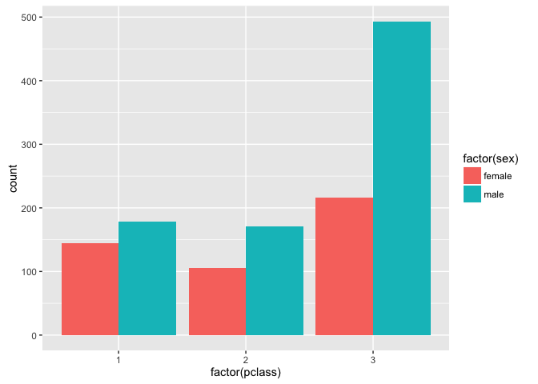
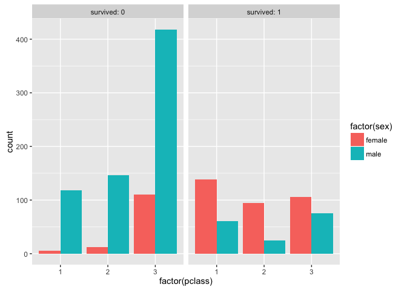
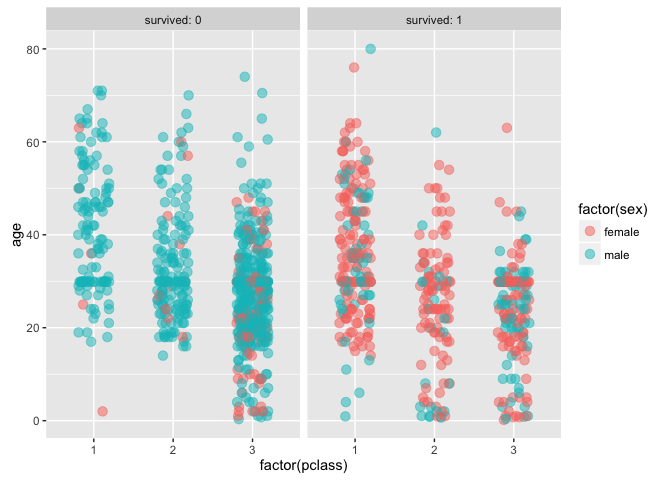
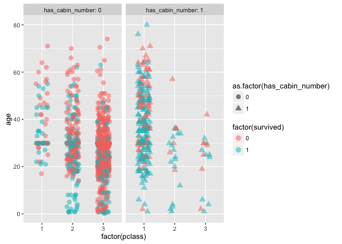

TitanicWrangling
================
Rajesh Jagannath
May 18, 2016

Titanic Data Wrangling Exercise
-------------------------------

This is an R Markdown document. This is for Springboard Foundations of Data Science Course Module 3 Data Wrangling exercise

Goal:
-----

##### (0) Load the data

##### (1) Fix Port of Embarkation

##### (2) Fix missing Age

##### (3) Lifeboat distribution

##### (4) Cabin - add a variable

##### (6) Save cleaned file

``` r
library(dplyr)
library(RSQLite)
library(tidyr)
library(ggplot2)
library(readr)
library(stringr)
library(scales)
library(mixtools)
library(readxl)

# For fun. Let's do some eda 
# What are the files in the dir 

dir()
```

    ##  [1] "README_files"           "README.md"             
    ##  [3] "README.Rmd"             "titanic_clean.csv"     
    ##  [5] "titanic_original.csv"   "Titanic.R"             
    ##  [7] "Titanic.Rproj"          "titanic3.xls"          
    ##  [9] "TitanicMarkdown.docx"   "TitanicMarkdown.html"  
    ## [11] "TitanicMarkdown.pdf"    "TitanicMarkdown.Rmd"   
    ## [13] "TitanicMarkdownPDF.pdf"

``` r
# list the sheets in the xl file 
excel_sheets("titanic3.xls")
```

    ## [1] "titanic3"

Load the data in R Studio
-------------------------

``` r
# we read it in 
titanic <- read_csv("titanic_original.csv", n_max= 1309)

# titanic is avaliable in your workspace

# Check out the structure of titanic
str(titanic)
```

    ## Classes 'tbl_df', 'tbl' and 'data.frame':    1309 obs. of  14 variables:
    ##  $ pclass   : int  1 1 1 1 1 1 1 1 1 1 ...
    ##  $ survived : int  1 1 0 0 0 1 1 0 1 0 ...
    ##  $ name     : chr  "Allen, Miss. Elisabeth Walton" "Allison, Master. Hudson Trevor" "Allison, Miss. Helen Loraine" "Allison, Mr. Hudson Joshua Creighton" ...
    ##  $ sex      : chr  "female" "male" "female" "male" ...
    ##  $ age      : num  29 0.917 2 30 25 ...
    ##  $ sibsp    : int  0 1 1 1 1 0 1 0 2 0 ...
    ##  $ parch    : int  0 2 2 2 2 0 0 0 0 0 ...
    ##  $ ticket   : chr  "24160" "113781" "113781" "113781" ...
    ##  $ fare     : num  211 152 152 152 152 ...
    ##  $ cabin    : chr  "B5" "C22 C26" "C22 C26" "C22 C26" ...
    ##  $ embarked : chr  "S" "S" "S" "S" ...
    ##  $ boat     : chr  "2" "11" NA NA ...
    ##  $ body     : int  NA NA NA 135 NA NA NA NA NA 22 ...
    ##  $ home.dest: chr  "St Louis, MO" "Montreal, PQ / Chesterville, ON" "Montreal, PQ / Chesterville, ON" "Montreal, PQ / Chesterville, ON" ...

Port of Embarkation
-------------------

The embarked column has some missing values, which are known to correspond to passengers who actually embarked at Southampton. Find the missing values and replace them with S.

``` r
## Locate the missing embarkers

# In embarked col find missing entries
levels(as.factor(titanic$embarked))
```

    ## [1] "C" "Q" "S"

``` r
# Now locate the missing embarkers
missing_embarked_idx<- as.vector(which(is.na(titanic$embarked)))
missing_embarked_idx
```

    ## [1] 169 285

``` r
str(missing_embarked_idx)
```

    ##  int [1:2] 169 285

    ## [1] "index 169 name =  Icard, Miss. Amelie embarked_from=  NA"
    ## [1] "index 285 name =  Stone, Mrs. George Nelson (Martha Evelyn) embarked_from=  NA"

``` r
# lets substitute their embarking status to "S"
  
titanic$embarked[is.na(titanic$embarked)]<-"S"
```

Fix missing age
---------------

Notice that a lot of the values in the Age column are missing. While there are many ways to fill these missing values, using the mean or median of the rest of the values is quite common in such cases.

``` r
# calculate the mean age of the remaining passengers
print( paste(" Mean age is ", mean(titanic$age,na.rm = TRUE)))
```

    ## [1] " Mean age is  29.8811345124283"

``` r
age_mean <-mean(titanic$age,na.rm = TRUE)

# let's update the  missing entries with mean age
 titanic$age[is.na(titanic$age)]<-mean(titanic$age,na.rm = TRUE)
```

Lifeboat distribution
---------------------

We’re interested in looking at the distribution of passengers in different lifeboats, but as we know, many passengers did not make it to a boat :-( This means that there are a lot of missing values in the boat column. Fill these empty slots with a dummy value e.g. the string 'None' or 'NA' \`\`\`

``` r
miss_boat_idx <- as.vector(which(is.na(titanic$boat)))
titanic$boat[miss_boat_idx] <-"None"
```

If we have a cabin number, it is likely the passenger survived to give the information Others with None may imply passenger did not survive

Lets add a variable using mutate and plot the graph

Cleaned up ?
============

``` r
str(titanic)
```

    ## Classes 'tbl_df', 'tbl' and 'data.frame':    1309 obs. of  15 variables:
    ##  $ pclass          : int  1 1 1 1 1 1 1 1 1 1 ...
    ##  $ survived        : int  1 1 0 0 0 1 1 0 1 0 ...
    ##  $ name            : chr  "Allen, Miss. Elisabeth Walton" "Allison, Master. Hudson Trevor" "Allison, Miss. Helen Loraine" "Allison, Mr. Hudson Joshua Creighton" ...
    ##  $ sex             : chr  "female" "male" "female" "male" ...
    ##  $ age             : num  29 0.917 2 30 25 ...
    ##  $ sibsp           : int  0 1 1 1 1 0 1 0 2 0 ...
    ##  $ parch           : int  0 2 2 2 2 0 0 0 0 0 ...
    ##  $ ticket          : chr  "24160" "113781" "113781" "113781" ...
    ##  $ fare            : num  211 152 152 152 152 ...
    ##  $ cabin           : chr  "B5" "C22 C26" "C22 C26" "C22 C26" ...
    ##  $ embarked        : chr  "S" "S" "S" "S" ...
    ##  $ boat            : chr  "2" "11" "None" "None" ...
    ##  $ body            : int  NA NA NA 135 NA NA NA NA NA 22 ...
    ##  $ home.dest       : chr  "St Louis, MO" "Montreal, PQ / Chesterville, ON" "Montreal, PQ / Chesterville, ON" "Montreal, PQ / Chesterville, ON" ...
    ##  $ has_cabin_number: num  1 1 1 1 1 1 1 1 1 0 ...

Plot
====

### Use ggplot()

### Plot 1

Refer to the histogram BELOW There were more men ( green) passengers than women( red). A majority of passengers them were pclass 3 passengers. There were 300 more men pclass 3 passengers than women pclass 3 passengers. 

### Plot 2

Refer to the chart BELOW. The left panel is those that perished (0) and Right is those that survived (1). There were more men who died than women. Most men and women that died were travelling as pclass 3 passengers. 

### Plot 3

This chart BELOW highlights age and survivorship. Far greater young men aged 20-30 perished(green) than women( red). pclass 3 passengers perished the most. pclass 1 passengers survived the most and were mostly women and were aged older than those that perished. Many children under the age of 15 survived - Those that did not survive were kids travelling as pclass 3. 

### Plot 4 ( Optional )

This scatter shows relationship between survivorship and having a cabin number. On the left is a panel for pasengers with no cabin number. On the right is a panel for passengers for whom we have cabin number records.
 More first class passengers seem to have cabin numbers.
 More people with cabin numbers seem to have survived to provide the cabin number info.

 Note that the `echo = FALSE` parameter was added to the code chunk to prevent printing of the R code that generated the plot.

``` r
# Lets fix the one NA in fare 
titanic$fare[is.na(titanic$fare)]<-mean(titanic$fare,na.rm = TRUE)
```

Save the cleaned file
---------------------

``` r
# Write out the cleaned data fraome into a csv file
write_csv(titanic,"titanic_clean.csv", append = FALSE, col_names=TRUE)
```
